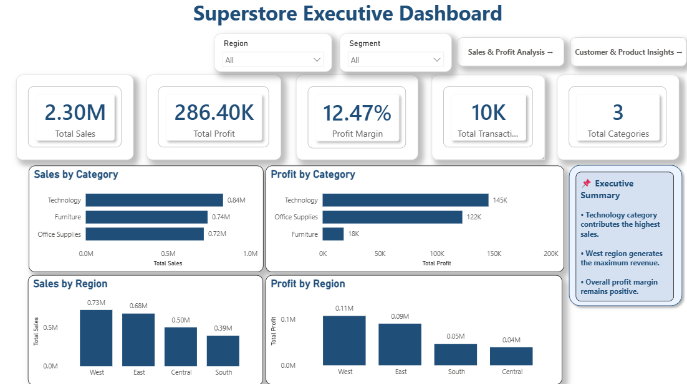
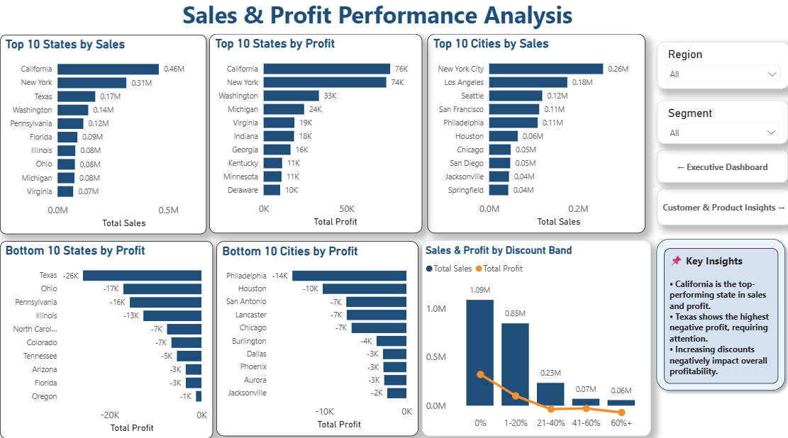
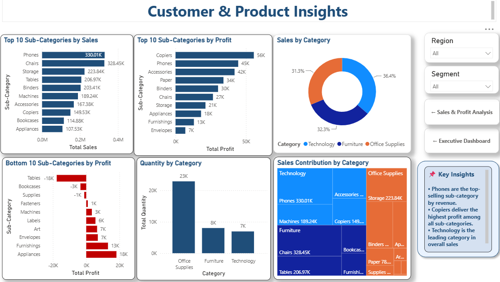

# 📊 Superstore Sales Analysis Dashboard (SQL + Power BI)

## 📌 Project Overview

This project is an end-to-end Data Analytics project built using SQL and Power BI. The objective is to analyze Superstore sales data, identify business trends, evaluate profitability, and build an interactive dashboard that supports data-driven decision-making.

---

## 🎯 Business Objectives

- Analyze overall sales and profit performance
- Identify top and bottom performing states and cities
- Understand the impact of discount on profitability
- Analyze category and sub-category performance
- Discover business insights for better decision making

---

## 🛠️ Tools & Technologies

- SQL
- Power BI
- Microsoft Excel
- DAX

---
## 📷 Dashboard Preview

### Executive Dashboard



---

### Sales & Profit Analysis



---

### Customer & Product Insights



## 📂 Project Workflow

1. Data Collection
2. Data Cleaning
3. SQL Analysis
4. Data Modeling
5. DAX Measures
6. Dashboard Design
7. Business Insights

---

## 📈 Dashboard Pages

### Executive Dashboard
- Total Sales
- Total Profit
- Profit Margin
- Total Transactions
- Sales by Category
- Profit by Region
- Executive KPIs

### Sales & Profit Performance
- Top 10 States by Sales
- Top 10 States by Profit
- Top 10 Cities by Sales
- Bottom 10 States by Profit
- Bottom 10 Cities by Profit
- Discount Impact on Sales & Profit

### Customer & Product Insights
- Top Selling Sub-Categories
- Most Profitable Sub-Categories
- Category-wise Sales
- Quantity Analysis
- Sales Contribution by Category
- Product Performance Analysis

---

## 📊 Key Business Insights

- Technology is the highest revenue-generating category.
- California contributes the highest sales and profit.
- Texas records the highest overall loss.
- Higher discounts reduce profitability significantly.
- Phones are the highest-selling sub-category.
- Copiers generate the highest profit among sub-categories.

---

## 📁 Repository Structure

```
Superstore-Sales-Analysis-SQL-PowerBI
│
├── Dashboard/
│   └── Superstore Dashboard.pbix
│
├── Dataset/
│   └── Superstore Dataset.csv
│
├── SQL/
│   └── SQL Queries.sql
│
├── Images/
│   └── Dashboard Preview.png
│
└── README.md
```

---

## 🚀 Author

**Parvin Shaikh**

Aspiring Data Analyst | SQL | Power BI | Excel | Python


